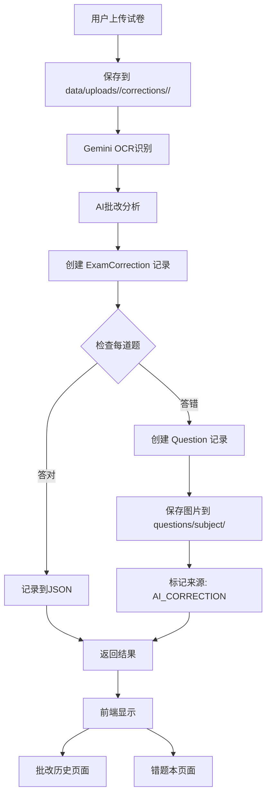

# AI批注历史系统（实现细节参考）

> 本文档保留为 **AI 批改系统的实现细节参考**。
>
> 从整体架构、模块化工程、训练/服务化选型、以及 AI 批改与错题本/学习建议/复习的整合视角，请以主设计文档为准：
> - `docs/AI_learning_assistant_design.md`

## 1. 概述

AI批注历史系统是学习小书童的核心功能之一，支持用户上传试卷图片，通过AI自动批改、打分、分析，并将结果持久化存储。系统自动识别错题并导入错题本，同时提供多维度的学习统计分析。

---

## 2. 核心功能

### 2.1 试卷批改流程

```
用户上传试卷图片
    ↓
保存到 data/uploads/<user>/corrections/<subject>/ 目录（用户隔离）
    ↓
Gemini 2.5 Flash OCR识别
    ↓
AI分析：题目、答案、知识点、错因
    ↓
自动批改打分
    ↓
生成批改后的图像（红笔标注）
    ↓
保存批注记录到数据库（ExamCorrection）
    ↓
扫描错题 → 自动创建Question记录
    ↓
错题图片保存到 data/uploads/<user>/questions/<subject>/ 目录（用户隔离）
    ↓
返回分析结果给前端
```

### 2.2 错题自动入库

**触发条件**：AI批改识别出学生答错的题目

**处理流程**：
1. 检查每道题的 `is_correct` 标记
2. 为 `is_correct=false` 的题目创建 `Question` 记录
3. 设置来源标记：`source = QuestionSourceEnum.AI_CORRECTION`
4. 关联批注记录：`exam_correction_id`
5. 复制图片到错题专用目录：`data/uploads/<user>/questions/<subject>/`
6. 提取知识点作为标签

**数据示例**：
```python
Question(
    user_id=1,
    exam_correction_id=123,  # 关联到批注记录
    title="第3题 - 解答题",
    content="求函数f(x)=x²-2x+1的最小值",
    subject=SubjectEnum.MATH,
    student_answer="最小值为0",
    correct_answer="最小值为0，当x=1时取得",
    image_urls=["questions/math/uuid_q3.jpg"],
    knowledge_points=["二次函数", "最值"],
    error_analysis="学生未注明取得最小值的x值",
    source=QuestionSourceEnum.AI_CORRECTION,
    source_description="AI批注试卷第3题",
)
```

### 2.3 文件存储结构

```
data/uploads/
├── {username_email}/        # 用户专属目录
│   ├── corrections/         # AI批注图片
│   │   ├── math/           # 数学试卷
│   │   │   ├── {file_hash[:32]}.jpg  # 原始试卷（按内容 hash 命名，便于去重/复用）
│   │   │   └── {file_hash[:32]}.png  # 批改后试卷（按内容 hash 命名）
│   │   ├── english/        # 英语试卷
│   │   ├── physics/        # 物理试卷
│   │   ├── chemistry/      # 化学试卷
│   │   ├── chinese/        # 语文试卷
│   │   └── biology/        # 生物试卷
│   │
│   └── questions/          # 错题图片
│       ├── math/           # 数学错题
│       │   └── {task_id}_q{num}.jpg  # 当前实现：复用本次上传 task_id 生成文件名（后续可升级为“裁剪+hash”）
│       ├── english/        # 英语错题
│       ├── physics/        # 物理错题
│       └── ...
│
└── {username2_email2}/     # 另一个用户的目录
    ├── corrections/
    └── questions/
```

**目录命名规则**：
- 格式：`{username}_{email}`
- 示例：`student001_student@example.com`
- 清理：移除文件系统不安全字符
- 长度限制：最多50字符

**设计优势**：
- ✅ **用户隔离**：每个用户有独立目录，数据完全隔离
- ✅ **按学科分类**：易于管理和统计
- ✅ **批注与错题分开**：清晰的数据组织
- ✅ **便于备份**：可按用户打包导出
- ✅ **支持扩展**：后续可添加时间维度（如 2024/math/）

---

## 3. 数据库设计

### 3.1 ExamCorrection 模型

```python
class ExamCorrection(Base):
    """AI批注记录模型"""
    __tablename__ = "exam_corrections"
    
    # 基本信息
    id: int
    user_id: int
    subject: SubjectEnum      # 学科（枚举）
    grade: str               # 年级
    exam_title: str          # 试卷标题
    
    # 图片引用（通过 ImageFile 表统一管理，支持去重/复用/权限校验）
    original_image_id: int        # 原始图片 image_files.id
    corrected_image_id: int       # 批改后图片 image_files.id（可为空）
    
    # 统计数据
    total_score: float           # 总得分
    max_score: float            # 满分
    accuracy_rate: float        # 正确率 (0-1)
    question_count: int         # 题目总数
    correct_count: int          # 答对数
    wrong_count: int            # 答错数
    
    # 分析结果
    overall_analysis: str        # 总体分析
    weak_points: List[str]       # 薄弱知识点
    improvement_suggestions: List[str]  # 改进建议
    questions_detail: List[dict]  # 所有题目详情（JSON）
    
    # 时间戳
    created_at: datetime
    updated_at: datetime
    
    # 关系
    user: User                   # 所属用户
    questions: List[Question]    # 关联的错题记录
```

### 3.2 Question 模型扩展

**新增字段**：
```python
exam_correction_id: int         # 关联的批注记录ID
source: QuestionSourceEnum      # 来源：MANUAL / AI_CORRECTION
source_description: str         # 来源描述
```

**来源枚举**：
```python
class QuestionSourceEnum(str, Enum):
    MANUAL = "manual"                   # 手动录入
    AI_CORRECTION = "ai_correction"     # AI批注识别
```

### 3.3 数据关联

```
User (用户)
  ├─ ExamCorrection (批注记录) 1:N
  │    └─ Questions (错题) 1:N
  └─ Question (错题) 1:N
```

**关联逻辑**：
- 一个用户可以有多条批注记录
- 一条批注记录可以产生多道错题
- 一道错题可能来自批注记录，也可能是手动录入

---

## 4. API 设计

### 4.1 批注记录 API

#### GET `/api/v1/corrections`
获取批注记录列表

**查询参数**：
- `page`: 页码（默认1）
- `page_size`: 每页数量（默认20）
- `subject`: 学科筛选（可选）
- `start_date`: 开始日期（可选）
- `end_date`: 结束日期（可选）

**响应**：
```json
{
  "total": 100,
  "page": 1,
  "page_size": 20,
  "items": [
    {
      "id": 1,
      "subject": "math",
      "grade": "高三",
      "exam_title": "数学月考试卷",
      "total_score": 85.0,
      "max_score": 100.0,
      "accuracy_rate": 0.85,
      "question_count": 10,
      "correct_count": 8,
      "wrong_count": 2,
      "weak_points": ["导数", "极值"],
      "created_at": "2024-12-18T10:00:00"
    }
  ]
}
```

#### GET `/api/v1/corrections/{id}`
获取批注记录详情

**响应**：包含完整的题目详情和分析结果

#### GET `/api/v1/corrections/statistics/{period}`
获取统计数据

**路径参数**：
- `period`: `week` | `month` | `quarter` | `year`

**响应**：
```json
{
  "period": "week",
  "start_date": "2024-12-11T00:00:00",
  "end_date": "2024-12-18T00:00:00",
  "total_corrections": 5,
  "total_questions": 50,
  "total_correct": 40,
  "total_wrong": 10,
  "avg_accuracy": 0.80,
  "avg_score": 82.5,
  "subject_stats": {
    "math": {
      "count": 3,
      "avg_accuracy": 0.85,
      "wrong_count": 6
    },
    "english": {
      "count": 2,
      "avg_accuracy": 0.75,
      "wrong_count": 4
    }
  },
  "time_series": [
    {
      "period": "2024-12-11",
      "count": 1,
      "avg_accuracy": 0.90
    }
  ]
}
```

#### DELETE `/api/v1/corrections/{id}`
删除批注记录（204 No Content）

### 4.2 OCR批改增强

#### POST `/api/v1/ocr/analyze`
试卷批改（已增强）

**新增功能**：
1. 自动保存批注记录到数据库
2. 错题自动创建Question记录
3. 文件按学科分类存储
4. 支持中文学科名称

**请求**：
```
Content-Type: multipart/form-data

file: (binary)
subject: "数学"
grade: "高三"
hint: "月考试卷"
```

**处理流程**：
```python
1. 读取图片并计算 hash（用于去重）
2. 保存/复用原图 → data/uploads/<user>/corrections/<subject>/{hash[:32]}.<ext>
3. OCR识别 + AI分析（Gemini 2.5 Flash）
4. 生成批改图片 → data/uploads/<user>/corrections/<subject>/{hash[:32]}.png
5. 写入 ImageFile（original/corrected）并创建 ExamCorrection（记录 image_id 引用）
6. 遍历题目，答错的创建 Question 记录
   - 当前实现：复制整张试卷为错题图片（后续可优化为裁剪）
   - 保存 → data/uploads/<user>/questions/<subject>/{task_id}_q{num}.<ext>
   - 标记来源：AI_CORRECTION
7. 返回分析结果（含 correction_id 与图片 URL）
```

---

## 5. 前端实现

本节 UI/交互设计内容已合并至主设计文档（避免重复维护）：
- `docs/AI_learning_assistant_design.md`（“关键业务流程 / 图片 URL 规范 / 前端 proxy 约束”）

前端具体实现文件仍可参考本文末“文件清单”。
- ✅ 缩放：50% - 300%（滚轮/按钮）
- ✅ 旋转：90°增量
- ✅ 拖拽移动（放大后）
- ✅ 下载图片
- ✅ 键盘快捷键（ESC关闭）

**UI设计**：
- 半透明工具栏（顶部/底部）
- 黑色背景（95%透明度 + 毛玻璃）
- 实时显示缩放百分比
- 悬浮操作提示

**集成页面**：
- ExamUpload - 原始/批改试卷
- QuestionSubmit - 上传的题目图片
- QuestionDetail - 题目关联图片（网格）
- QuestionList - 缩略图预览
- CorrectionHistory - 批改记录图片

### 5.3 错题录入增强

**双模式输入**：
```
┌─────────────────────────────────┐
│ [文字输入]  [图片上传] ← 切换    │
└─────────────────────────────────┘
```

**图片模式功能**：
- 点击上传 / 拖拽上传 / 拍照上传
- 实时预览
- 点击预览图放大查看
- OCR自动识别题目内容
- 支持学科和难度选择

---

## 6. 统计分析

### 6.1 统计维度

| 维度 | 时间范围 | 用途 |
|------|---------|------|
| week | 最近7天 | 每日学习追踪 |
| month | 最近30天 | 月度总结 |
| quarter | 最近90天 | 季度复盘 |
| year | 最近365天 | 年度报告 |

### 6.2 统计指标

**基础指标**：
- 总批改次数
- 总题目数
- 正确/错误题数
- 平均正确率
- 平均得分

**学科统计**：
- 每个学科的批改次数
- 每个学科的平均正确率
- 每个学科的错题数

**时间序列**：
- 按天/周分组的趋势数据
- 用于绘制正确率趋势图
- 支持前端图表展示

### 6.3 数据查询优化

```sql
-- 基础统计（使用聚合函数）
SELECT 
    COUNT(*) as total_corrections,
    SUM(question_count) as total_questions,
    AVG(accuracy_rate) as avg_accuracy
FROM exam_corrections
WHERE user_id = ? AND created_at >= ?

-- 学科分组统计
SELECT 
    subject,
    COUNT(*) as count,
    AVG(accuracy_rate) as avg_accuracy,
    SUM(wrong_count) as wrong_count
FROM exam_corrections
WHERE user_id = ? AND created_at >= ?
GROUP BY subject

-- 时间序列（按天）
SELECT 
    DATE(created_at) as date,
    COUNT(*) as count,
    AVG(accuracy_rate) as avg_accuracy
FROM exam_corrections
WHERE user_id = ? AND created_at >= ?
GROUP BY DATE(created_at)
ORDER BY date
```

---

## 7. 技术实现细节

### 7.1 学科映射

**支持中文输入**：

```python
SUBJECT_NAME_MAP = {
    "数学": "math",
    "英语": "english",
    "物理": "physics",
    "化学": "chemistry",
    "语文": "chinese",
    "生物": "biology",
    "其他": "other",
}

def parse_subject_type(subject: str) -> SubjectType:
    """支持中英文输入"""
    subject_en = SUBJECT_NAME_MAP.get(subject, subject.lower())
    try:
        return SubjectType(subject_en)
    except ValueError:
        return SubjectType.OTHER
```

### 7.2 中文字体处理

**问题**：PIL默认字体不支持中文，批改图片显示方框

**解决方案**：
```python
def _load_chinese_font(self, size: int = 24):
    """按优先级尝试多个系统字体"""
    font_paths = [
        # macOS
        "/System/Library/Fonts/STHeiti Medium.ttc",
        "/System/Library/Fonts/Hiragino Sans GB.ttc",
        "/System/Library/Fonts/PingFang.ttc",
        # Linux
        "/usr/share/fonts/truetype/wqy/wqy-microhei.ttc",
        "/usr/share/fonts/truetype/noto/NotoSansCJK-Regular.ttc",
        # Windows
        "C:\\Windows\\Fonts\\msyh.ttc",
        "C:\\Windows\\Fonts\\simhei.ttf",
    ]
    
    for font_path in font_paths:
        try:
            return ImageFont.truetype(font_path, size)
        except:
            continue
    
    logger.warning("未找到中文字体，文字可能显示为方框")
    return ImageFont.load_default()
```

### 7.3 图片URL路径规范

**API路径**：
```
GET /api/v1/ocr/images/corrections/{correction_id}/{image_type}
GET /api/v1/image-files/{image_id}/content
```

**前端使用**：
```javascript
// 批注图片（原图/批改后图）
// 注意：图片访问由 default 模块统一提供，因此在“前端 proxy 模式”下通常是：
// /api/default/v1/ocr/images/corrections/<id>/original
// /api/default/v1/ocr/images/corrections/<id>/corrected
const correctionImageUrl = `/api/default/v1/ocr/images/corrections/${correctionId}/${imageType}`

// 通用图片文件（ImageFile.id），用于错题/批注等图片二进制访问
//  无法携带 Authorization header 时，可用 ?token=...（由后端解析）
const imageFileUrl = `/api/default/v1/image-files/${imageId}/content?token=${token}`
```

**后端处理**：
- **批注图片**：default 模块通过 `ExamCorrection` 的 `original_image_id/corrected_image_id` 找到 `ImageFile`，再定位文件并返回 `FileResponse`
- **通用图片**：default 模块通过 `ImageFile.id` 校验用户权限并返回 `FileResponse`

---

## 8. 用户体验设计（已合并到主设计文档）

为减少冗余维护，本节 UX 设计已合并到：
- `docs/AI_learning_assistant_design.md`

---

## 9. 数据流图（概览）



> 说明：当前实现中实际落盘路径为 `data/uploads/<user>/corrections/<subject>/...` 与 `data/uploads/<user>/questions/<subject>/...`。
> 图片元信息统一写入 `ImageFile`（去重、引用计数、权限校验），批改记录 `ExamCorrection` 通过 `original_image_id/corrected_image_id` 引用图片。

---

## 10. 安全性考虑（概要）

### 10.1 访问控制
- ✅ 所有 API 需要认证（JWT）
- ✅ 用户只能访问自己的批改/错题/图片
- ✅ 图片访问必须校验用户权限（default 模块统一处理）

### 10.2 文件安全
- ✅ 文件类型验证（仅图片）
- ✅ 文件大小限制（建议 <10MB）
- ✅ 文件名规范化（原图/批改图按内容 hash 命名；错题图按 task_id 命名），并由后端做路径拼接与校验，防止路径遍历
- ✅ 按用户隔离存储（uploads/<user>/...）

### 10.3 数据隐私
- ✅ 试卷内容仅用户本人可见
- ✅ 统计数据仅包含当前用户
- ✅ 不跨用户推荐或比较

---

## 11. 性能优化

### 11.1 数据库优化
- ✅ 索引：user_id, subject, created_at
- ✅ 分页查询，避免一次加载过多数据
- ✅ 统计查询使用聚合函数
- ✅ JSON字段存储详情，避免JOIN

### 11.2 文件存储优化
- ✅ 学科分类目录，减少单目录文件数
- ✅ 图片压缩（可选，PIL支持）
- ✅ CDN加速（生产环境可接入）

### 11.3 前端优化
- ✅ 图片懒加载
- ✅ React Query 缓存
- ✅ 骨架屏加载状态
- ✅ 防抖节流

---

## 12. 扩展性设计

### 12.1 未来功能

**批注记录**：
- [ ] 批注记录详情页
- [ ] 支持手动编辑批改结果
- [ ] 导出PDF报告
- [ ] 批改记录分享（家长查看）

**统计分析**：
- [ ] 可视化图表（折线图、柱状图）
- [ ] 错题率热力图
- [ ] 知识点掌握雷达图
- [ ] 学习进步趋势

**文件管理**：
- [ ] 按年份归档（2024/math/）
- [ ] 云存储集成（OSS/S3）
- [ ] 图片自动压缩
- [ ] 过期文件清理策略

**智能推荐**：
- [ ] 基于批改历史推荐复习内容
- [ ] 识别学习规律和高峰时段
- [ ] 生成个性化学习计划

### 12.2 技术改进

**OCR准确度**：
- [ ] 图片预处理（去噪、增强）
- [ ] 多模型集成（投票机制）
- [ ] 用户反馈纠错（RLHF）

**性能提升**：
- [ ] 异步任务队列（Celery）
- [ ] Redis缓存统计结果
- [ ] 数据库读写分离

---

## 13. 测试验证

### 13.1 功能测试清单

**批改功能**：
- [ ] 上传不同学科试卷
- [ ] 验证图片保存路径正确
- [ ] 检查批注记录创建
- [ ] 验证错题自动入库
- [ ] 检查图片文件完整性

**统计功能**：
- [ ] 切换时间周期，数据正确更新
- [ ] 学科筛选，数据准确过滤
- [ ] 统计数字计算正确
- [ ] 时间序列数据完整

**前端交互**：
- [ ] 图片放大功能正常
- [ ] 缩放、旋转、拖拽流畅
- [ ] 分页功能正常
- [ ] 移动端适配良好

### 13.2 边界测试

- [ ] 无批改记录时的空状态
- [ ] 大量记录的分页性能
- [ ] 单个试卷大量题目（>50题）
- [ ] 并发上传多张试卷
- [ ] 图片文件不存在的错误处理

---

## 14. 部署说明

### 14.1 数据库表创建/演进（Repo Reality）

本仓库默认使用 SQLite（`data/sqlite/app.db`）并在启动时自动创建表：
- `backend/core/db/session.py` → `init_db()` → `Base.metadata.create_all(...)`
- 同时包含轻量级 SQLite “best-effort migrations”（为旧库补列/修复 PK），避免教学项目引入复杂 Alembic 运维

如在生产使用 PostgreSQL 并需要严谨迁移，可再引入 Alembic（本仓库文档不强制要求）。

### 14.2 目录初始化

```bash
# 创建基础数据目录（用户/学科子目录会在首次上传时自动创建）
mkdir -p data/{sqlite,faiss,bm25,uploads,redis} logs
```

### 14.3 环境变量

无需为“批改历史”新增环境变量；图片与数据库都落在 `data/` 下。

如启用 GraphRAG：

```bash
export GRAPHRAG_ENABLED=true
```

---

## 15. API文档更新

已注册到 FastAPI 自动文档：

访问 `http://localhost:6100/docs`

新增 API 分组：
- **Corrections - AI批注记录**
  - GET /api/v1/corrections
  - GET /api/v1/corrections/{id}
  - GET /api/v1/corrections/statistics/{period}
  - DELETE /api/v1/corrections/{id}

---

## 16. 总结

### 实现的核心价值

1. **学习轨迹可视化**：完整记录每次批改，形成学习档案
2. **智能错题管理**：AI自动识别错题，免去手动录入
3. **数据驱动改进**：多维度统计帮助发现薄弱点
4. **文件规范管理**：学科分类存储，便于长期维护

### 技术亮点

- 🎯 双向关联：批注↔错题
- 🎯 自动化流程：OCR→批改→入库一气呵成
- 🎯 多维统计：时间+学科双维度
- 🎯 用户体验：现代化UI，图片放大，响应式设计

### 文件清单

**后端（关键文件）**：
1. `backend/core/db/models.py` - 数据模型（`ExamCorrection` / `Question` / `ImageFile` 等）
2. `backend/core/crud/crud_exam_correction.py` - 批改记录 CRUD（列表/统计/删除等）
3. `backend/core/crud/crud_image_file.py` - 图片文件入库/去重/引用计数等
4. `backend/core/services/gemini_ocr_service.py` - OCR/试卷结构化分析核心（Provider 模式）
5. `backend/modules/tony/services/gemini_ocr_prompts.py` - tony 模块 OCR prompts/provider（完整实现）
6. `backend/modules/<module>/api/endpoints/ai_correction/ocr.py` - OCR 分析入口（如 `tony`：`POST /api/v1/ocr/analyze`）
7. `backend/modules/<module>/api/endpoints/ai_correction/corrections.py` - 批改历史列表/统计接口
8. `backend/modules/default/api/endpoints/ocr.py` - 批注图片统一访问接口（by correction_id）
9. `backend/modules/default/api/endpoints/image_files.py` - 图片内容统一访问接口（by image_id）

**前端（6个）**：
9. `frontend/src/pages/CorrectionHistory.jsx` - 批改历史页面
10. `frontend/src/components/ImageViewer.jsx` - 图片查看器
11. `frontend/src/App.jsx` - 路由
12. `frontend/src/components/Layout.jsx` - 导航
13. `frontend/src/pages/ExamUpload.jsx` - 集成查看器
14. `frontend/src/pages/QuestionSubmit.jsx` - 支持图片+查看器
15. `frontend/src/pages/QuestionDetail.jsx` - 集成查看器
16. `frontend/src/pages/QuestionList.jsx` - 缩略图+查看器

**文档（推荐入口）**：
- `docs/DEPLOYMENT.md` - 部署与运维（含 proxy / docker / 模型服务化）
- `docs/TRAINING.md` - GraphRAG/训练流水线（Tony first）
- `docs/AI_CORRECTION_SYSTEM.md` - 本文档

---

**系统已就绪，可以开始使用。**

