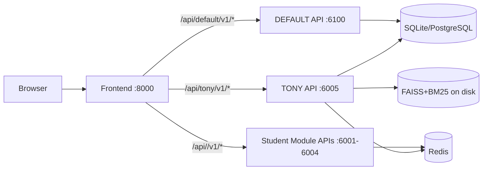

# 学习小书童：AI Agent 学习助手（设计与工程实现）

> 本文是学习小书童的**主设计文档（canonical）**：覆盖整体架构、AI 批改/错题本、RAG/GraphRAG、训练与服务化、以及模块化工程规范。
>
> 相关参考文档：
> - `docs/DEPLOYMENT.md`：部署与运维（含 `pipeline.sh`）
> - `docs/TRAINING.md`：GraphRAG/训练流水线（Tony first）
> - `docs/AI_CORRECTION_SYSTEM.md`：AI 批改系统**实现细节参考**（本次已将核心内容合并进本文，原文作为附录/历史参考保留）

## 1. 项目概述

### 1.1 愿景

打造一个面向初中/高中学生的个性化 AI 学习助手——“学习小书童”。它既是错题记录工具，也是一个能够基于学生长期数据（错题、批改、反馈、复习表现）持续进化的智能学习伙伴：能定位薄弱点、给出可执行计划、引导练习与复盘，并可在学科维度进行模块化扩展。

### 1.2 核心功能（按用户视角）

- **AI 批改历史**：上传试卷图片 → OCR+批改+统计 → 自动生成错题
- **错题本**：手动/图片录入，支持分组（按上传）、标签聚合、时间筛选
- **举一反三**：相似题检索 + 讲解/训练建议（Hybrid 检索 + RAG）
- **学习建议**：薄弱点诊断、学习计划生成（可选 GraphRAG 增强）
- **复习计划**：到期复习题推送、间隔重复/复习节奏管理
- **模型训练与服务化**：基于用户数据构建 KB、数据集、微调（SFT/DPO），并以高可用方式部署推理服务

## 2. 设计原则

- **模块化**：按学科/模块拆分（`backend/modules/<module>` 与 `training/modules/<module>` 一一对应）
- **数据可追溯**：批改→错题→知识点→复习计划链路可追踪、可解释
- **离线/在线分离**：在线服务稳定可用；离线流水线（KB/数据集/训练/部署）可重复、可审计
- **可观测性与可运维**：日志、任务队列、索引文件落盘路径清晰
- **安全与隐私**：最小权限、用户隔离、图片访问鉴权、防路径遍历

## 3. 模块化架构（Repo Reality）

### 3.1 模块说明

- `default`：跨模块聚合能力 + **图片统一访问接口**（前端 proxy 模式下尤为重要）
- `tony`：完整实现（History/Geography/Other）；作为参考实现与生产能力基线
- `rpj / xmx / wzy / wzm`：student TODO 模块（仅保留入口与 TODO）

### 3.2 运行时拓扑（推荐：前端单端口代理）



> 代理与端口详见：`docs/DEPLOYMENT.md`

## 4. 数据与存储规范（AI 批改/错题本共用）

### 4.1 文件存储结构（用户隔离 + 学科隔离）

数据目录：`data/uploads/<username_email>/`

```
data/uploads/
└── {username_email}/
    ├── corrections/<subject>/
    │   ├── {file_hash[:32]}.<ext>    # 原始试卷（按内容 hash 命名，便于去重/复用）
    │   └── {file_hash[:32]}.png      # 批改后试卷（按内容 hash 命名）
    └── questions/<subject>/
        └── {task_id}_q{num}.<ext>    # 当前实现：按上传 task_id 命名（可演进为“裁剪+hash”）
```

### 4.2 结构化数据模型（概念级）

- `ExamCorrection`：一次试卷批改的元数据 + 统计 + 题目明细（JSON）+ 原图/批改图引用
- `Question`：错题记录（可来自手动录入或 AI 批改），含题干、答案、错因、知识点、标签、图片引用、分组信息（上传组）
- `ImageFile`：统一的图片文件元信息与引用计数（支持去重/复用）
- `Feedback`：用户对 AI 输出的偏好/修正（用于 preference 数据集）

> 详细字段与表结构请以代码为准（`backend/core/db/models.py`），本文强调链路关系与工程约束。

### 4.3 图片 URL 规范（前端必须遵循）

图片访问由 **default 模块统一提供**（避免各学科模块重复实现、保证 proxy 模式一致）。

- 批注图片（按 correction_id）：
  - `GET /api/v1/ocr/images/corrections/{correction_id}/{image_type}`
- 通用图片（按 image_id）：
  - `GET /api/v1/image-files/{image_id}/content`

前端 proxy 模式下常用：

- `/api/default/v1/ocr/images/corrections/<id>/original`
- `/api/default/v1/ocr/images/corrections/<id>/corrected`
- `/api/default/v1/image-files/<image_id>/content?token=<jwt>`（当 `` 无法携带 header 时）

## 5. 关键业务流程（合并 AI 批改系统内容）

### 5.1 AI 批改（试卷上传→批改历史→错题自动入库）

流程概览：

```
用户上传试卷图片
  → 保存到 corrections/<subject>/
  → Gemini 2.5 Flash（多模态 OCR/理解）
  → AI 批改/打分/错因/知识点
  → 生成批改后图片（红笔标注）
  → 写入 ExamCorrection（批改历史）
  → 扫描错题 is_correct=false → 自动创建 Question
  → 错题图保存到 questions/<subject>/
  → 前端展示批改结果 + 批改历史列表/统计
```

对应接口（按模块）：

- OCR/批改入口（学科模块）：`POST /api/v1/ocr/analyze`
- 批改历史（学科模块）：`GET /api/v1/corrections` / `GET /api/v1/corrections/{id}` / `GET /api/v1/corrections/statistics/{period}` / `DELETE /api/v1/corrections/{id}`

关键工程点：

- **事务与锁**：长耗时 OCR/LLM 调用前应提交事务释放锁（SQLite 场景尤为重要）；并启用 WAL+busy_timeout（已在 core 处理）
- **图片统一管理**：图片入库统一走 `ImageFile`（去重、引用计数、权限校验）
- **学科 prompt 可插拔**：`backend/core/services/gemini_ocr_service.py` 通过 provider 模式加载 `backend/modules/<module>/services/gemini_ocr_prompts.py`

### 5.2 错题录入（手动/图片）与错题本展示

- **录入**：文本/图片 OCR → 结构化解析 → 写入 `Question` →（可选）更新索引
- **错题本**：支持时间范围过滤、按上传分组（`group_by=upload`）、分组标签聚合、分组创建时间展示

### 5.3 举一反三（Hybrid 检索 + RAG）

- **检索层**：FAISS（向量）+ BM25（关键词）混合召回，落盘到 `data/faiss/<module>/` 与 `data/bm25/<module>/`
- **生成层**：将原题、错因、相似题上下文喂给 LLM 生成讲解与练习建议

#### 5.3.1 原理：为什么要 Hybrid（向量 + 关键词）

教育场景的“相似题”检索往往同时需要：

- **语义相似**：题干改写、同一知识点不同表述、同一题型不同材料（向量更强）
- **关键词匹配**：专有名词/年代/地名/术语、固定搭配（BM25 更稳）

因此采用 **混合召回**（Hybrid Retrieval）：

- **FAISS**：用 embedding 找语义相近的候选（Top-N）
- **BM25**：用倒排 + TF-IDF/BM25 找关键词相近的候选（Top-N）
- **融合排序**：按权重融合两路分数（可在配置/调用参数中调整）

> 这保证系统在“材料题/史实细节/关键词题”与“概念题/同义改写题”上都有稳定召回。

#### 5.3.2 方案设计：索引构建、融合与在线调用

**索引构建（离线）**

- 输入语料：模块内题库（通常来自 `Question`、公开题库 ETL、教材/课标结构化内容等）
- 产物落盘：
  - 向量索引：`data/faiss/<module>/`
  - BM25 索引：`data/bm25/<module>/`
- 推荐入口（Tony first）：

```bash
./deploy/scripts/pipeline.sh kb --module tony --build-index --embedding-backend hash
./deploy/scripts/pipeline.sh embed-index --module tony --embedding-backend hash
```

> `hash` embedding 仅用于离线流程验证；真实效果建议 `sentence-transformers`（需本地可用 HF cache）。

**在线调用（RAG 生成前的“证据构建”）**

典型链路：

1) 由“原题/错因/知识点/标签”等形成检索 query  
2) 调用混合检索获得候选题 id 列表（可带 `exclude_question_ids` 避免返回原题/已做过的题）
3) 批量拉取候选题详情（题干/答案/解析/标签/知识点/图片）
4) 把候选题作为“证据上下文”喂给 LLM 生成讲解与训练建议

在工程实现上，这一流程既可走 **本地 service**（直接调用 `HybridSearchService`），也可走 **工具化调用**（见 5.5 MCP 工具层中的 `search_questions/get_questions`）。

### 5.4 学习建议与复习（GraphRAG 可选增强）

- **GraphRAG**：`data/training/<module>/graphrag/graph.json`（轻量文件图谱）
- 运行时开关：`GRAPHRAG_ENABLED=true`
- Tony 已在 learning/guidance 与 similar-question retrieval 中对 GraphRAG 做了 feature-gated 集成

#### 5.4.1 原理：GraphRAG 在教育场景解决什么问题

纯向量/关键词检索主要基于“文本相似”，但在教育场景常见的需求是：

- **按知识点扩展**：同一知识点下题型多样、表述差异大，纯相似检索易漏召回
- **按先修/关联关系扩展**：某错因来自前置概念薄弱（需要跨概念扩展练习）
- **按标签扩展**：题型标签、能力维度标签（如“时间轴/因果分析/材料解读”）更贴近教学设计

GraphRAG 通过“可解释的关系图”把候选集从“相似文本”扩展为“相似概念/关系邻域”，并保留可追溯的扩展路径（便于解释与调试）。

#### 5.4.2 方案设计：图谱构建、扩展检索与开关

**图谱构建（离线）**

- 产物：`data/training/<module>/graphrag/graph.json`
- 构建入口（Tony first）：

```bash
./deploy/scripts/pipeline.sh kb --module tony
```

**扩展检索（在线/工具化均可）**

以“相似题推荐”为例：

- Base：先做 Hybrid 检索得到一批 base candidates
- Expand（可选）：在 `GRAPHRAG_ENABLED=true` 时，基于以下信号扩展候选：
  - `knowledge_points`：按知识点邻域扩展
  - `tags`：按标签邻域扩展（例如题型/能力维度）
- Merge：将扩展候选与 base candidates 去重合并，再排序取 Top-K 返回

**工程开关**

- `GRAPHRAG_ENABLED=true`：启用 GraphRAG 扩展（默认关闭，确保线上可控）

> 当启用 MCP 检索（5.5）时，GraphRAG 扩展可下放到 MCP server 端统一实现（工具 schema 已支持 `knowledge_points/tags/include_graphrag`）。

### 5.5 MCP 工具层（Model Context Protocol，Phase 1：Tony retrieval-mcp）

为统一“检索/证据/图谱扩展/题目详情获取”等工具能力，本项目引入 MCP（Model Context Protocol）作为 agent 的工具调用层（Tony 先落地）。

**服务端（MCP Server）**
- 代码：`backend/mcp_servers/tony/retrieval_server.py`
- 默认地址：`http://127.0.0.1:7010/mcp`
- 核心工具：
  - `search_questions(query_text, user_id, subject?, knowledge_points?, tags?, include_graphrag?, ...)`
    - 混合检索：FAISS + BM25
    - GraphRAG 扩展（可选）：按 knowledge_points / tags 扩展候选题
  - `get_questions(question_ids, user_id)`：批量拉取题目详情（用于 RAG 生成上下文）
  - `get_task(task_id)`：任务快照（Phase 2 ops-mcp 的 starter）

**客户端（MCP Client）**
- 代码：`backend/core/mcp/retrieval_client.py`
- Tony 接入点：`backend/modules/tony/agents/learning/similar_question_agent.py`
  - `vector_retrieval` 节点在 `MCP_RETRIEVAL_ENABLED=true` 时优先走 MCP；否则使用原本地检索路径

**开关与启动**

```bash
# 启动 MCP server（独立于 API/Agent/Frontend）
./deploy/scripts/start_mcp.sh tony_retrieval up

# 在后端进程中启用 MCP 调用
export MCP_RETRIEVAL_ENABLED=true
export MCP_RETRIEVAL_URL=http://127.0.0.1:7010/mcp

# 如需图谱扩展
export GRAPHRAG_ENABLED=true
```

### 5.6 评估与可观测性（telemetry-first）

为保证“提升可量化”，本项目引入通用事件表 `metric_events`：
- 代码：`backend/core/db/models.py`（`MetricEvent`）
- 写入：`backend/core/services/metrics_service.py`（best-effort，不影响主流程）

Tony 的评估脚本：
- `training/modules/tony/eval/metrics_from_db.py`：工具成功率/延迟、推荐接受率、反馈正向占比、任务失败率、旅程耗时、D1/D7 留存（关键事件口径）
- `training/modules/tony/eval/retrieval_hit_rate.py`：hit@k（人工标注或弱监督）

## 6. 技术选型（开发/运维维度的理由）

### 6.1 后端与任务系统

- **FastAPI**：高性能、类型友好、自动文档
- **SQLAlchemy Async**：统一 ORM 层，方便替换 SQLite/PostgreSQL
- **Celery + Redis**：长耗时 OCR/分析、批改生成、数据集构建等后台任务可异步化（每模块独立 queue）

### 6.2 检索与知识库

- **FAISS + BM25**：不引入外部向量 DB 服务，部署简单；同时覆盖“语义相似”和“关键词匹配”两种需求
- **GraphRAG（文件图谱）**：在“知识点关系/先修关系/章节结构”上优于纯向量；第一阶段使用 file-based graph 便于落地与运维

### 6.3 多模态 OCR/理解

- **Gemini 2.5 Flash**：在试卷图像场景中具备较强 OCR+理解能力；通过统一 `LLM_API_ENDPOINT` 接入，避免供应商耦合
- **Provider 模式**：学科 prompt 与日志策略模块化，便于 student module 二次实现

## 7. 模型训练选型（SFT/DPO/RLAIF/Constitutional）

### 7.1 基座模型选型

- **首选**：`OpenPipe/Qwen3-14B-Instruct`（Tony）
- **理由**：中文能力强、指令跟随稳定、生态成熟（Transformers/PEFT/TRL/vLLM）
- **工程建议**：70B 对算力要求高；在开发/验证阶段可先用 7B/14B 跑通数据与评估闭环，再切换 70B

### 7.2 训练策略（推荐分阶段）

1) **SFT（监督微调）**：对齐教育场景输出风格（耐心、结构化、可执行建议）
2) **DPO（偏好优化）**：基于用户反馈（chosen/rejected）提升“更像老师、更符合预期”的输出
3) **RLAIF/Constitutional AI（可选）**：当人工偏好不足时，使用 AI 反馈/宪法约束补齐安全与一致性（建议作为后续迭代）

### 7.3 数据来源与构建

- **用户数据**：批改记录（ExamCorrection）、错题（Question）、反馈（Feedback）
- **公开题库/教材**：按学科 ETL、去重、结构化
- **合成数据**：用强模型生成“讲解/错因/复习建议”样本（需严格过滤与抽检）

### 7.4 SFT（监督微调）原理、方案与使用

#### 7.4.1 原理（训练目标）

SFT 的目标是让基座模型在教育场景具备更强的一致性与可控性：

- 输出风格：耐心、鼓励、结构化（先结论→再依据/步骤→练习建议与复盘要点）
- 任务偏好：先定位薄弱点，再给可执行建议
- 表达习惯：面向初高中、避免过度学术化

#### 7.4.2 数据格式与构建

本项目 SFT 使用 JSONL（每行一个样本），核心字段为：

```json
{"instruction": "...", "input": "...", "output": "..."}
```

- `instruction`：任务指令（如“请讲解这道题并给出练习建议”）
- `input`：题干/材料/学生答案/错因等上下文（可空）
- `output`：期望模型输出（讲解/步骤/建议）

#### 7.4.3 工程设计：配置、产物与训练命令

**配置**

- Tony SFT config：`training/modules/tony/fine_tuning/configs/sft_qwen3_14b_lora.json`
- 关键参数：
  - `model_name`：基座模型（推荐 `OpenPipe/Qwen3-14B-Instruct`）
  - `system_prompt`：模块/学科 persona（决定输出风格与边界）
  - LoRA/QLoRA 参数：`lora_r/lora_alpha/lora_dropout/...`

**产物**

- LoRA/QLoRA adapter：`data/training/<module>/checkpoints/sft_lora/<subject>/`
- tokenizer 同目录保存（用于推理一致性）

**训练命令**

```bash
./deploy/scripts/pipeline.sh train-sft --module tony --subject history
```

可选参数：

- `--hf-max-workers 32`：提高/降低 HuggingFace 下载并发（网络抖动时建议降到 4/2/1）
- `--hf-revision <commit|tag|main>`：固定基座模型版本（默认 `main`；强烈建议生产复现时 pin 到 commit）

#### 7.4.4 基座模型下载（断点续传 + 固定 revision）

为避免大模型反复下载与“断线后重下”，离线流水线将 HF 缓存固定到 repo 内：

- `HF_HOME=<repo>/data/.cache/huggingface`
- `HF_HUB_CACHE=$HF_HOME/hub`
- 额外稳定目录：`HF_MODEL_LOCAL_DIR=<repo>/data/models/hf`

训练脚本会：

1) 按 `revision`（默认 main，可通过 `--hf-revision` 指定 commit）预下载模型文件到本地目录  
2) 打印“已存在文件数/缺失文件数”（可直观看到是否在续传）  
3) 下载完成后以 `local_files_only=True` 从本地目录启动训练，避免训练过程中再触发网络下载

> 只有当 upstream `main` 更新导致 `refs/main` 指向新 commit 时，`snapshots/<sha>` 才会变化；pin 到 commit 可确保完全可复现。

### 7.5 DPO（偏好优化）原理、方案与使用

#### 7.5.1 原理（训练目标）

DPO 的目标是利用偏好数据把模型输出进一步对齐到“用户更喜欢的答案”：

- 相同 prompt 下，模型学习更倾向于 `chosen`、远离 `rejected`
- 在教育场景中，偏好通常体现为：更清晰、步骤更对、建议更可执行、语气更像老师

#### 7.5.2 数据格式与来源

本项目 DPO 数据采用 TRL 兼容 JSONL：

```json
{"prompt": "...", "chosen": "...", "rejected": "..."}
```

数据来源建议优先级：

1) **真实用户反馈**（`Feedback`）：用户选择更好的回答/对比回答  
2) **弱监督/规则生成**：基于 rubric 自动构造 preference pair（需抽检）  
3) **RLAIF（后续迭代）**：用强模型作为 judge 生成偏好（需严控偏差）

#### 7.5.3 工程设计：配置、产物与训练命令

- Tony DPO config：`training/modules/tony/fine_tuning/configs/dpo_qwen3_14b_lora.json`
- 训练命令：

```bash
./deploy/scripts/pipeline.sh train-dpo --module tony
```

产物（LoRA adapter）：

- `data/training/<module>/checkpoints/dpo_lora/...`（以 config 输出目录为准）

> DPO 通常在完成 SFT 后进行；也可在小规模偏好数据上做快速增量验证。

## 8. 离线流水线与脚本（按模块）

结构原则：

- 共享：`training/core/`
- 业务与参数：`training/modules/<module>/`

Tony 典型命令（详见 `docs/DEPLOYMENT.md` / `docs/TRAINING.md`）：

```bash
./deploy/scripts/pipeline.sh kb --module tony --build-index --embedding-backend hash
./deploy/scripts/pipeline.sh embed-index --module tony --embedding-backend hash
./deploy/scripts/pipeline.sh datasets --module tony
./deploy/scripts/pipeline.sh train-sft --module tony
./deploy/scripts/pipeline.sh train-dpo --module tony
./deploy/scripts/pipeline.sh serve-model --module tony up
```

## 9. 项目结构（更新）

```
/learning_assistant
├── docs/AI_learning_assistant_design.md  <-- 本设计文档
├── backend/
│   ├── core/                           # 共享核心层（db/models/services/crud/schemas）
│   └── modules/                        # 模块化应用层（default/rpj/xmx/wzy/wzm/tony）
│       └── <module>/
│           ├── main.py                 # FastAPI app entry
│           ├── api/                    # API endpoints/router
│           ├── agents/                 # LangGraph agents
│           └── celery_app.py           # Celery queue for module
├── frontend/
│   ├── src/
│   ├── package.json
│   └── Dockerfile
├── training/                           # 离线流水线（GraphRAG / 数据集 / 微调）
│   ├── core/                           # 共享流水线代码
│   └── modules/                        # 按模块拆分（tony 完整实现，其他为 student TODO）
├── deploy/scripts/                     # 启动/部署脚本（在线 + 离线 pipeline）
├── docker-compose.modules.yml          # 多模块 Docker Compose
└── .gitignore
```

## 10. 进一步迭代方向（研发路线）

- **评测体系**：题目讲解正确率、错因定位准确率、计划可执行性（A/B + 人工抽检）
- **安全与合规**：未成年人场景的内容安全策略、敏感信息脱敏、日志采样与删除策略
- **知识关系增强**：GraphRAG 从“字段驱动的图”演进到“教材/课标驱动的图”
- **学习闭环**：复习完成结果回写 → 更新薄弱点 → 调整计划 → 生成新的每日练习

