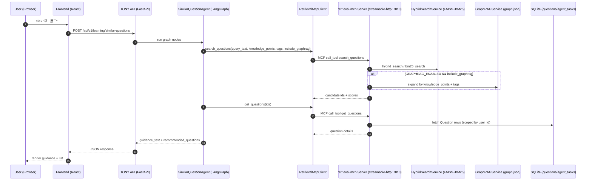
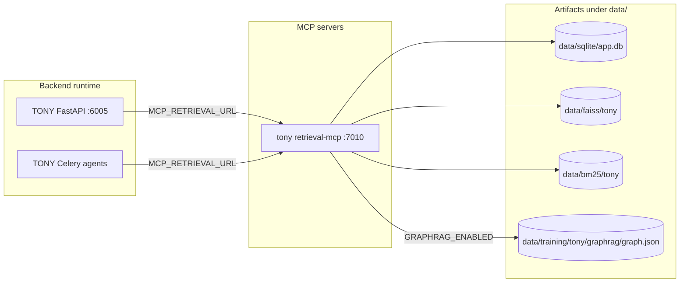

## Architecture

### High-level components

This project uses a **module-based backend** (one FastAPI app per module) and a shared frontend.

Modules:
- `default` (6100): cross-subject aggregation + shared endpoints
- `rpj` (6001): 语文/英语/政治 (student TODO module)
- `xmx` (6002): 经济学 (student TODO module)
- `wzy` (6003): 数学/物理 (student TODO module)
- `wzm` (6004): 化学 (student TODO module)
- `tony` (6005): 历史/地理/其他 (**full implementation first**)

Shared infrastructure:
- SQLite DB (shared): `data/sqlite/app.db`
- Hybrid retrieval per module (FAISS + BM25): `data/faiss/<module>` + `data/bm25/<module>`
- Upload storage: `data/uploads/<user>/...`
- Redis: Celery broker/results + caching

### MCP layer (Model Context Protocol) — tool servers

This repo introduces an MCP tool layer to make “retrieval / ops / training-loop” callable in a structured way by agents.

**Phase 1 (implemented, Tony first)**:
- `backend/mcp_servers/tony/retrieval_server.py` (Streamable HTTP, default `http://127.0.0.1:7010/mcp`)
- Backend agents call it via `backend/core/mcp/retrieval_client.py`
- Feature flag (per backend process):
  - `MCP_RETRIEVAL_ENABLED=true`
  - `MCP_RETRIEVAL_URL=http://127.0.0.1:7010/mcp`

**Tool-to-code mapping**:
- `search_questions(query_text, user_id, subject?, knowledge_points?, tags?, include_graphrag?, ...)`
  - Hybrid retrieval: `backend/core/services/hybrid_search_service.py`
  - Optional Graph expansion (feature-gated): `backend/core/services/graphrag_service.py`
    - `find_questions_by_knowledge_points(...)`
    - `find_questions_by_tags(...)`
- `get_questions(question_ids, user_id)` → SQL `Question` lookup (via `crud_question.get_question`)
- `get_task(task_id)` → SQL `AgentTask` lookup (Phase 2 starter; for ops workflows)

**LangGraph integration point (Tony)**:
- `backend/modules/tony/agents/learning/similar_question_agent.py`
  - Node `vector_retrieval` calls MCP when enabled; otherwise falls back to legacy local retrieval.

### MCP end-to-end call chain (bilingual)

**English (end-to-end)**
- When a user requests “similar questions / guidance”, Tony’s LangGraph agent calls retrieval tools via MCP.
- The MCP server encapsulates hybrid retrieval (FAISS+BM25), optional GraphRAG expansion (knowledge points + tags), and DB fetch for question details.

**中文（端到端链路）**
- 用户触发“举一反三/学习引导”后，Tony 的 LangGraph agent 会通过 MCP 调用检索工具。
- MCP server 将混合检索（FAISS+BM25）、GraphRAG 扩展（知识点 + tags）与题目详情查询（DB）封装成结构化工具，降低 prompt 复杂度并提升可解释性与可维护性。

#### Sequence diagram (MCP retrieval path)



#### Component diagram (MCP deployment shape)



### Runtime architecture diagram (services)

```mermaid
flowchart LR
  subgraph FE[Frontend]
    UI[React + Vite]
  end

  subgraph API[Backend Modules (FastAPI)]
    D[default :6100]
    R[rpj :6001]
    X[xmx :6002]
    W1[wzy :6003]
    W2[wzm :6004]
    T[tony :6005]
  end

  subgraph Infra[Shared Infra]
    DB[(SQLite/Postgres)]
    Redis[(Redis)]
    Uploads[(data/uploads)]
    Vec[(FAISS + BM25 per module)]
  end

  UI -->|/api/<module>/v1/*| D
  UI --> R
  UI --> X
  UI --> W1
  UI --> W2
  UI --> T

  D --> DB
  R --> DB
  X --> DB
  W1 --> DB
  W2 --> DB
  T --> DB

  D --> Vec
  R --> Vec
  X --> Vec
  W1 --> Vec
  W2 --> Vec
  T --> Vec

  D --> Uploads
  R --> Uploads
  X --> Uploads
  W1 --> Uploads
  W2 --> Uploads
  T --> Uploads

  D --> Redis
  R --> Redis
  X --> Redis
  W1 --> Redis
  W2 --> Redis
  T --> Redis
```

### Offline pipeline (GraphRAG + fine-tuning) diagram

```mermaid
flowchart TB
  DB[(data/sqlite/app.db)] -->|ETL| DS[SFT dataset / preference dataset]
  DB -->|Graph build| G[GraphRAG graph.json]
  Uploads[(data/uploads)] --> DS

  DS -->|SFT (LoRA/QLoRA)| SFT[Adapter checkpoints]
  DS -->|DPO (optional)| DPO[Preference checkpoints]

  SFT --> Serve[vLLM / serving]
  DPO --> Serve

  G --> Runtime[Backend GraphRAG Service]
  Runtime --> Agents[tony learning/review agents]
  Serve --> Agents
```

### Personal model (“小书童”) integration

When enabled, some Tony endpoints will call the user’s **personal fine-tuned model** (served by vLLM, OpenAI-compatible):
- Service wrapper: `backend/core/services/personal_model_service.py`
- Per-module env vars: `PERSONAL_MODEL_ENABLED_<MODULE>`, `PERSONAL_MODEL_API_BASE_<MODULE>`, `PERSONAL_MODEL_MODEL_<MODULE>`
- Tony-first business usage:
  - companion chat: `backend/modules/tony/api/endpoints/companion/chat.py`
  - learning-plan: `backend/modules/tony/api/endpoints/learning/guidance.py`
  - similar-questions generation: `backend/modules/tony/agents/learning/similar_question_agent.py`

Trace logging (prompt/retrieval/output to jsonl; default ON):
- `./logs/trace_personal_model_<module>.jsonl`
- Disable: `export PERSONAL_MODEL_TRACE_ENABLED=false`
- Docs: `docs/PERSONALIZATION_SYSTEM.md`

### Source layout (important folders)

- `backend/core/`: shared schemas/services/crud/db
- `backend/modules/<module>/`: per-module FastAPI + agents + endpoints
- `training/`: offline pipelines
  - `training/core/`: shared pipeline code (GraphRAG, datasets, preference optimization)
  - `training/modules/tony/`: Tony full pipeline entrypoints
- `deploy/scripts/`: scripts
  - Online services startup: `start.sh`, `start_module.sh`, `start-docker.sh`
  - Offline/training pipeline: `pipeline.sh`
- `data/`: runtime + training artifacts
  - `data/training/<module>/graphrag/graph.json`
  - `data/training/<module>/datasets/...`
  - `data/training/<module>/checkpoints/...`

