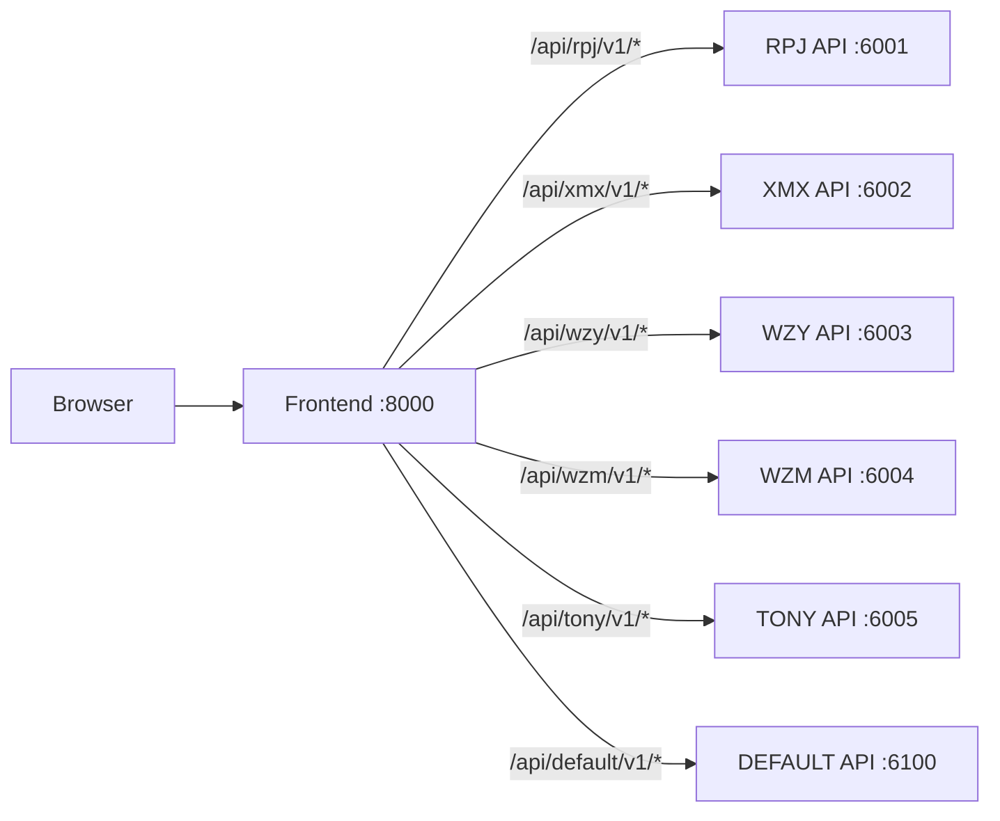

## Deployment

This document consolidates deployment-related docs into one place:
- Local (conda) multi-module startup
- Docker multi-module deployment
- Frontend proxy routing (single external port)
- Model serving (vLLM) and GraphRAG enablement

### Quickstart (local / conda)

Online services (API/Agent/Frontend):

```bash
./deploy/scripts/start.sh all
./deploy/scripts/start.sh status
```

Optional MCP service (Phase 1: Tony retrieval-mcp):

```bash
./deploy/scripts/start_mcp.sh tony_retrieval up
./deploy/scripts/start_mcp.sh tony_retrieval status
```

What `start.sh all` does (high level):
- Ensures required directories under `data/` and `logs/`
- Starts Redis if `redis-server` is available (for Celery queues)
- Starts module APIs (FastAPI) and module Agent workers (Celery) as needed
- Starts frontend (Vite dev server)

Offline pipelines (KB / datasets / training / model serving):

```bash
./deploy/scripts/pipeline.sh help
./deploy/scripts/pipeline.sh kb --module tony --build-index --embedding-backend hash
```

Recommended end-to-end (Tony) flow:

```bash
# 1) Build GraphRAG KB (graph.json) + rebuild retriever index (FAISS+BM25)
./deploy/scripts/pipeline.sh kb --module tony --build-index --embedding-backend hash

# 2) Prepare datasets (SFT + preference)
./deploy/scripts/pipeline.sh datasets --module tony

# 3) Fine-tune (SFT LoRA/QLoRA) — requires GPU for large models
./deploy/scripts/pipeline.sh train-sft --module tony

# 4) Preference optimization (DPO) — optional, requires preference pairs
./deploy/scripts/pipeline.sh train-dpo --module tony

# 5) Serve model (vLLM, OpenAI-compatible; per-module and all)
./deploy/scripts/pipeline.sh serve-model --module tony up
./deploy/scripts/pipeline.sh serve-model --module all up
```

Note (vLLM / transformers>=4.44):
- If the model tokenizer does not define a `chat_template`, `/v1/chat/completions` will return 400.
- Fix: inject a ChatML template at vLLM startup and restart the service:

```bash
./deploy/scripts/pipeline.sh serve-model --module tony down
export VLLM_CHAT_TEMPLATE_TONY=./deploy/vllm/chat_templates/template_chatml.jinja
./deploy/scripts/pipeline.sh serve-model --module tony up --runtime vllm
```

### Ports & modules

| Module | Port | Subjects |
|---|---:|---|
| default | 6100 | cross-subject aggregation |
| rpj | 6001 | chinese / english / politics (student TODO module) |
| xmx | 6002 | economics (student TODO module) |
| wzy | 6003 | math / physics (student TODO module) |
| wzm | 6004 | chemistry (student TODO module) |
| tony | 6005 | history / geography / other |

### Agents (Celery workers) & Redis

Each module has its own Celery queue (`queue_<module>`). Redis is the broker/result backend.

Local dev:
- `deploy/scripts/start.sh` will attempt to start Redis via `redis-server --daemonize yes`
- If you manage Redis yourself, ensure `redis-cli ping` works

Docker:
- Redis is included in `docker-compose.modules.yml`

### Frontend proxy routing (recommended: expose one port)

In production-like setups, expose **only** the frontend port (e.g. `8000`) and proxy:



The concrete proxy config lives in `frontend/vite.config.js` and `frontend/src/config/moduleRouting.js`.

### Docker deployment (multi-module)

This repo provides a split docker compose file that runs:
- Redis (shared)
- API + Agent per module
- Frontend

Primary compose file:
- `docker-compose.modules.yml`

Example:

```bash
# Start all (redis + all module apis + all module agents + frontend)
./deploy/scripts/start-docker.sh all

# Start only one module (example: tony)
./deploy/scripts/start-docker.sh tony

# Status/logs
./deploy/scripts/start-docker.sh status
./deploy/scripts/start-docker.sh logs api-tony
```

### Health checks

When running locally (no proxy):

```bash
curl http://localhost:6005/health   # tony
curl http://localhost:6100/health   # default
```

When running via frontend proxy:

```bash
curl http://localhost:8000/health/tony
curl http://localhost:8000/health/default
```

### Vector store (FAISS + BM25) — “no separate DB service”

This project does **not** run an external vector database service.

Instead, each module persists its own hybrid index to disk:
- `data/faiss/<module>/index.faiss` + `data/faiss/<module>/store.json` + `data/faiss/<module>/mapping.json`
- `data/bm25/<module>/bm25.pkl`

Runtime behavior:
- Module APIs initialize the vector store on startup (load existing indices if present).
- New questions can be embedded and appended by the system (module-specific flows).

Operational tasks:
- Rebuild Tony index (offline, deterministic, no HF downloads):

```bash
./deploy/scripts/pipeline.sh kb --module tony --build-index --embedding-backend hash
```

### GraphRAG enablement (runtime)

GraphRAG is feature-gated:

```bash
export GRAPHRAG_ENABLED=true
```

Runtime expects:
- `data/training/<module>/graphrag/graph.json`

Build Tony graph (and optionally index) via:

```bash
./deploy/scripts/pipeline.sh kb --module tony --build-index --embedding-backend hash
```

### MCP services (Phase 1: retrieval-mcp)

This project can run a separate MCP server for retrieval to provide a structured tool API for agents:
- Tony retrieval MCP server:
  - module: `tony`
  - port: `7010`
  - endpoint: `http://127.0.0.1:7010/mcp`
  - code: `backend/mcp_servers/tony/retrieval_server.py`
  - tools: `search_questions` (hybrid + optional GraphRAG by knowledge_points/tags), `get_questions`, `get_task`, `health`

#### Start/stop script (recommended)

Use the dedicated script:

```bash
# Start
./deploy/scripts/start_mcp.sh tony_retrieval up

# Status
./deploy/scripts/start_mcp.sh tony_retrieval status

# Stop
./deploy/scripts/start_mcp.sh tony_retrieval down
```

#### Enable MCP usage in backend processes

MCP is feature-gated by environment variables in the backend (API and Agent workers):

```bash
export MCP_RETRIEVAL_ENABLED=true
export MCP_RETRIEVAL_URL=http://127.0.0.1:7010/mcp
```

Graph expansion is still gated independently:

```bash
export GRAPHRAG_ENABLED=true
```

### Dataset preparation (Tony)

This generates training JSONL under `data/` from the production SQLite DB:
- SFT:
  - `data/training/tony/datasets/sft/<subject>/train.jsonl` (per-subject)
  - (legacy, optional) `data/training/tony/datasets/sft/train.jsonl`
- Preference (DPO): `data/training/tony/datasets/preference/train.jsonl`

Command:

```bash
./deploy/scripts/pipeline.sh datasets --module tony
```

Notes:
- Preference dataset may be **empty** if you have not collected feedback pairs (`feedbacks.original_response` + `feedbacks.preferred_response`).
- You can smoke-run with limits by calling the underlying scripts directly (see `docs/TRAINING.md`).

### Model training (Tony)

#### SFT (LoRA/QLoRA)

Uses config:
- `training/modules/tony/fine_tuning/configs/sft_qwen3_14b_lora.json`

Run:

```bash
./deploy/scripts/pipeline.sh train-sft --module tony --subject history
```

Outputs (default):
- `data/training/tony/checkpoints/sft_lora/<subject>/`

Operational notes:
- Qwen3-14B still requires meaningful VRAM; for smoke tests, edit `model_name` in the config to a smaller model (e.g. 7B) first.

#### DPO (preference optimization, optional)

Uses config:
- `training/modules/tony/fine_tuning/configs/dpo_qwen3_14b_lora.json`

Run:

```bash
./deploy/scripts/pipeline.sh train-dpo --module tony
```

Outputs (default):
- `data/training/tony/checkpoints/dpo_lora/`

Operational notes:
- DPO requires preference pairs; if your preference dataset is empty, DPO training will not be meaningful.

### Model serving (vLLM, per-module)

Paths convention:
- Base model cache (HuggingFace Hub, shared): `/home/dataset-assist-0/data/work/.cache/huggingface/hub/`
- Fine-tuning outputs (per-module, in repo): `./data/training/<module>/checkpoints/`

Start a local OpenAI-compatible endpoint using local vLLM (default):

```bash
./deploy/scripts/pipeline.sh serve-model --module tony up
```

Prefetch / resume base model download into the unified classroom HF cache (recommended on first run):

```bash
./deploy/scripts/pipeline.sh fetch-model --module tony
```

Unified HF cache path (used by training + `fetch-model` + `serve-model`):
- `/home/dataset-assist-0/data/work/.cache/huggingface/hub/`

Stop / logs:

```bash
./deploy/scripts/pipeline.sh serve-model --module tony down
./deploy/scripts/pipeline.sh serve-model --module tony logs
```

### Model endpoint evaluation (OpenAI-compatible)

Once the model server is running, evaluate the served model via OpenAI-compatible requests:

```bash
./deploy/scripts/pipeline.sh eval-model --module tony
./deploy/scripts/pipeline.sh eval-model --module all
```

Reports:
- `data/training/<module>/eval/model_eval_report.json`
- (Tony) `data/training/tony/eval/retrieval_eval_report.json` (retrieval precision/recall/hit@k; merged into model report)

Verify:

```bash
curl http://127.0.0.1:8001/v1/models
```

Note: some OpenAI-compatible servers (vLLM + transformers>=4.44) may reject `/v1/chat/completions` if the tokenizer has no `chat_template`.
Our evaluator will automatically fall back to `/v1/completions` in that case, so `eval-model` still works without changing your vLLM launch flags.

Default ports:
- tony: `8001`
- rpj: `8002`
- xmx: `8003`
- wzy: `8004`
- wzm: `8005`

Override per-module port:

```bash
export VLLM_PORT_TONY=8001
```

LoRA auto-discovery (by convention):
- `data/training/<module>/checkpoints/dpo_lora/`  -> `<module>-dpo`
- `data/training/<module>/checkpoints/sft_lora/<subject>/` -> `<module>-sft-<subject>`

#### Backend integration: personal model (“小书童”)

Companion uses module-scoped env vars:

```bash
export PERSONAL_MODEL_ENABLED_TONY=true
export PERSONAL_MODEL_API_BASE_TONY=http://127.0.0.1:8001/v1
export PERSONAL_MODEL_MODEL_TONY=tony-dpo
```

Other modules follow the same pattern (example):

```bash
export PERSONAL_MODEL_ENABLED_RPJ=true
export PERSONAL_MODEL_API_BASE_RPJ=http://127.0.0.1:8002/v1
export PERSONAL_MODEL_MODEL_RPJ=rpj-dpo
```

Subject-specific LoRA routing (recommended; default ON):
- Backend will prefer `<module>-sft-<subject>` when subject is selected in the UI (e.g. `tony-sft-history`).
- If the subject LoRA is missing, requests are blocked when this flag is enabled:

```bash
export COMPANION_REQUIRE_SUBJECT_MODEL=true
```

To allow fallback during development:

```bash
export COMPANION_REQUIRE_SUBJECT_MODEL=false
```

#### End-to-end closed-loop (Tony)

With all switches enabled, Tony supports a closed loop:
- **小书童对话**: DB memory + Hybrid retrieval (FAISS+BM25) + optional GraphRAG → personal model (vLLM LoRA).
- **学习建议/学习计划**: DB review set + optional GraphRAG → personal model (preferred) / shared LLM fallback.
- **举一反三**: MCP retrieval (or local vector store fallback) + optional GraphRAG → personal model (preferred) / shared LLM fallback.

Debug logging:

```bash
export PERSONAL_MODEL_LOG_VERBOSE=true
```

Then point backend LLM settings to it (example):

```bash
export DEFAULT_LLM_PROVIDER=openai
export OPENAI_API_KEY=EMPTY
export OPENAI_API_BASE=http://localhost:8001/v1
export OPENAI_MODEL=tony-qwen3-14b
```

### Common environment variables (ops)

- **Shared**
  - `DATABASE_URL` (default: SQLite under `data/sqlite/app.db`)
  - `SECRET_KEY`
  - `REDIS_URL` / `CELERY_BROKER_URL` / `CELERY_RESULT_BACKEND`
  - `PUBLIC_API_BASE_URL` (optional; used to generate external URLs)
- **LLM**
  - `LLM_API_ENDPOINT` + `LLM_API_KEY` (Gemini OCR service uses unified LLM endpoint)
  - `OPENAI_API_BASE` + `OPENAI_MODEL` (optional; if using vLLM/OpenAI-compatible server)
- **GraphRAG**
  - `GRAPHRAG_ENABLED=true`
